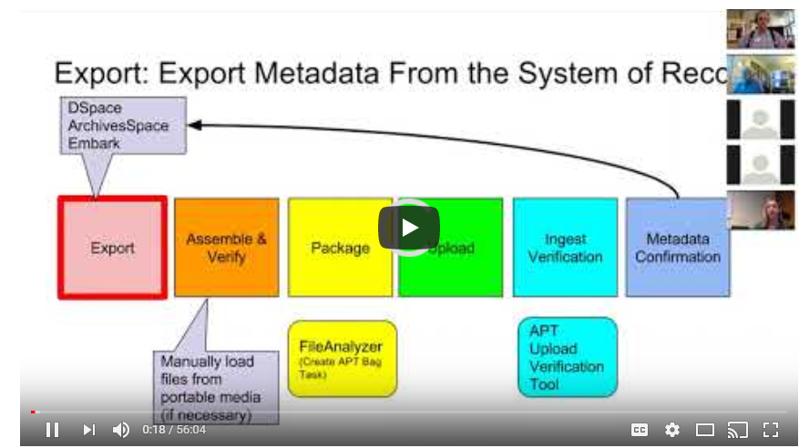

# Georgetown's Preservation Workflow Strategy for Academic Preservation Trust

This presentation describes the systems that the Georgetown University Library built to ingest content into the [Academic Preservation Trust](http://aptrust.org/) system.  
This material was presented as a webinar to the Academic Preservation Trust Bagging Interest Group on Sep 28, 2017.
The tools described in this presentation were developed in 2016.  Using these tools from Sep 2016-Sep 2017, the Georgetown University Library processed the majority of it's backlog of digital files requiring preservation.  The workflows described in this presentation will support the preservation of future digital assets.

## Presentation Slides
[Georgetown's Preservation Workflow Bagging Strategy for Academic Preservation Trust](https://docs.google.com/presentation/d/e/2PACX-1vQa6qObo617BtslVo6AxutjZ6duHyp0UluFuURw5_sHIHTDP54KH1t8nCcjayn9CAXRNyj-TkwE5Xc5/pub?start=false&loop=false&delayms=3000)

* Terry Brady, Application Programmer Analyst, Georgetown University Library
* Suzanne Chase, Head, Digital Services Unit, Georgetown University Library

## Webinar Recording

## Tools
The Georgetown University Library developed these tools to support our APTrust Preservation Workflows.  The following code is available for use by other institutions.
* [File Analyzer - Create APTrust Bag Files](https://github.com/Georgetown-University-Libraries/File-Analyzer/wiki/Bagit-automation-for-Academic-Preservation-Trust-(APTrust))
* [APTrust Upload Verification Tool](https://github.com/Georgetown-University-Libraries/APTUploadVerification)
* [ArchivesSpace Object Export Tool](https://github.com/Georgetown-University-Libraries/ASObjectExport)
